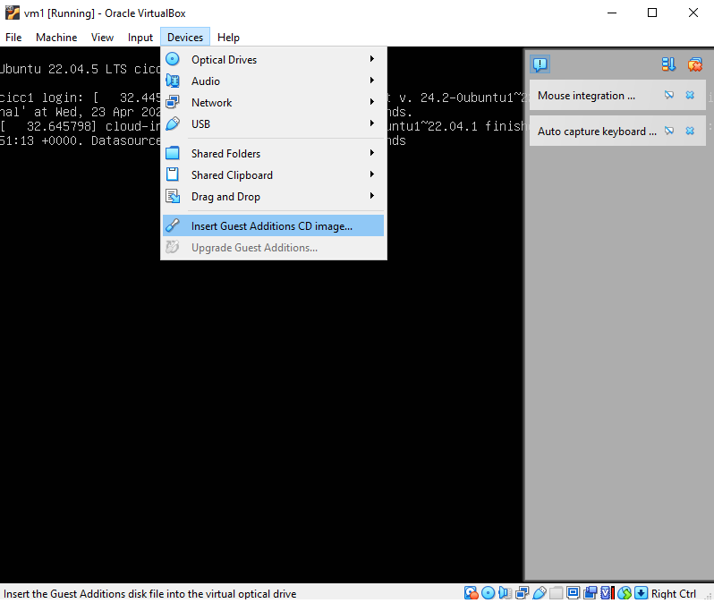

# vbox-cpu-hotplug

## Prerequisites

We assume you have created a VirtualBox virtual machine, so that we can try to adjust virtual hardware resources on the fly. More specially, we will adjust the CPU capacity while the virtual machine is running, which is hard for the traditional physical machine.

### 1. Prepare CPU hot plug feature for your VM.

By default, CPU Hot-Plugging feature is not enabled for your VM, once it's created. We need to make some preparations for it.

We can't make use of this feature in the graphical interface of VirtualBox. Instead, we can use the command line tool, VBoxManage, to manipulate the VM.

This tool may not be usable directly. If that happens, you can include the installation path of VirtualBox into the environment variables in your operating system, to fix it.

Once this is done, keep your VM powered off for a moment, and you can use the following commands in your prompt / terminal to set the CPU capacity:

```bash
    VBoxManage modifyvm VM1 --cpu-hotplug on
    VBoxManage modifyvm VM1 --cpus 4
```

VM1 is the name of the VM you created, and this name is assigned and controlled by you. The number of CPUs can also be changed based on the condition of your CPU.

You only need to do this once.

### 2. Monitor the CPU usage of your VM.

Now let's start the VM.

```bash
    VBoxManage startvm VM1
```

To have resource provisioning, we need to first collect the performance data in term of usages of system resources. You can use the following commands to collect the target performance data:

```bash
    VBoxManage metrics enable VM1 Guest/CPU/Load/Idle
    VBoxManage metrics collect –period 2 –samples 5 VM1 Guest/CPU/Load/Idle
    VBoxManage metrics query VM1 Guest/CPU/Load/Idle > monitor.dat
```

There is no output after the first command.

The performance metric used here is Guest/CPU/Load/Idle. The data collection period is 2 seconds. For each record, there will be 5 data points (samples). These can all the be changed based on your design.

The "VBoxManage metrics collect" command will keep generating some outputs, and you can press Ctrl+C to stop (change it based on your OS). Once this is done, the data will be saved periodically in the background (not showed on the screen), so that you can repeat "VBoxManage metrics query" command to get the data again and again. This is the third command in the table above, and the output is redirected to a file named monitor.dat, which can be changed as you need. 

### 3. CPU Hotplug
Based on the collected performance data, once your program finds that the idle CPU resource is limited, e.g., lower than 10%, you can consider performing the CPU Hot-Plugging with the following command:

```
$ VBoxManage controlvm VM1 plugcpu 2
```

The number at the end is the index of the CPU. If there are totally 4 CPUs reserved for your VM, the indices will be from 0 to 3. Each time, you just plug in one more CPU with the corresponding index. You can plug in more CPUs when needed.

You can keep watching the performance data in your program. Once a new CPU core is plugged in, you can observe the change. If the idle CPU is constantly above a certain threshold, e.g., 85%, you can consider removing some CPU by:

```
$ VBoxManage controlvm VM1 unplugcpu 2
```

Change the VM name and index of CPU as you want. But `CPU 0 can't be removed`.

#### 3.1 Error in CPU Unplug

There might be some errors after running this command for unplugging:

```
VBoxManage.exe: error: Hot-Remove was aborted because the CPU may still be used by the guest
VBoxManage.exe: error: Details: code VBOX_E_VM_ERROR (0x80bb0003), component ConsoleWrap, interface IConsole, callee IUnknown
VBoxManage.exe: error: Context: "HotUnplugCPU(n)" at line 412 of file VBoxManageControlVM.cpp
```

This might be caused by two common reasons:
(1) The second cpu is still in use.
(2) Guest Additions are not installed for our guest OS.

To resolve this:
(1) Inside guest OS, check whether the second cpu is in use:
```bash
ls /sys/devices/system/cpu
```
Other than cpu0, you might see cpu1, which is the second cpu. Then in the same guest OS terminal, try the following command:
```bash
sudo cat /sys/devices/system/cpu/cpu1/online
```
If the content is 0, the cpu is not in use. Otherwise, we need to manually set it to 0 (if it's in use, that means the VM is busy, so it's not a good time to do CPU unplug. But if you insist in doing CPU unplug, do the following job in your guest OS terminal):
```bash
sudo echo 0 > /sys/devices/system/cpu/cpu1/online
```

(2) To install the guest additions, we need to run the following commands in the guest OS:
```bash
sudo apt update
sudo apt install build-essential dkms linux-headers-$(uname -r) gcc make perl
```
Then go to your VM's VirtualBox window, find Devices -> Insert Guest Additions CD image...


Go back to guest OS, and mount the cdrom and make the installtion:
```bash
sudo mount /dev/cdrom /media
sudo /media/VBoxLinuxAdditions.run
```
Once the guest additions are installed, we should be ready to do cpu unplug.

